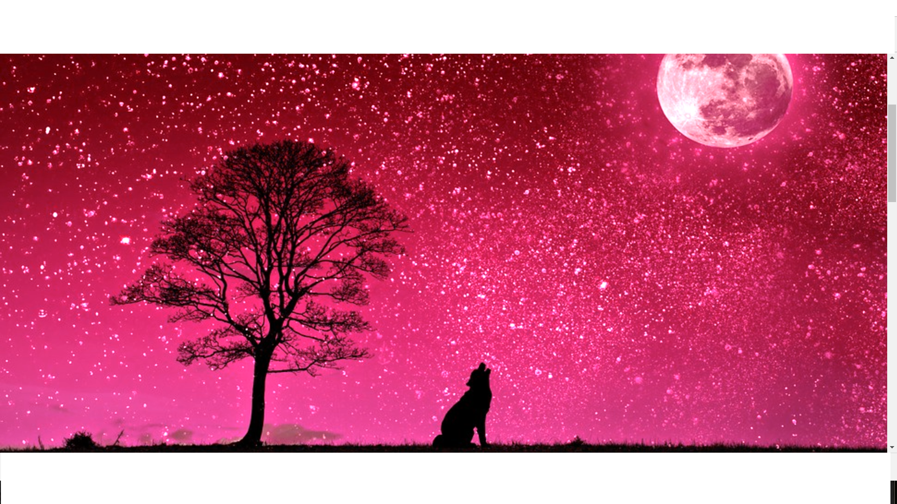

This is the css modification of zengarden done in the first term. This project is in another folder which is in

the vivixx folder so I have to seperate it. The word zen makes me think about something restful and peaceful.

With that being said, I have chosen to have the stars as the background because looking up makes you think

about the wonders of the universe and it makes one feel at ease as well. Technology has made the world a

smaller space. We are living in a small world with infinite ideas. Below are the snapshots of the css zengarden

website.

